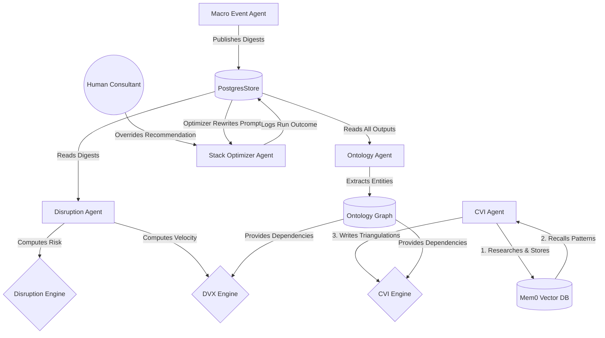

# How Agent Learning Feeds the CVI and Disruption Indexes

The Capability Economics platform operates a continuous feedback loop where autonomous agents research the market, learn from the data (and from human overrides), and feed those learnings directly into the mathematical models that compute the CVI (Capability Value Index) and DVX (Disruption Velocity Index).

This document explains exactly how the three memory layers—Mem0, PostgresStore, and the Prompt Optimizer—connect the agents to the indexes.

---

## The Three Memory Layers

Before tracing the data flow, it is important to understand the three distinct types of memory the agents use:

1. **Mem0 (Vector + Semantic Memory)**
   - **What it stores:** Raw observations, insights, and validated patterns from Perplexity research cycles.
   - **How it works:** When the CVI Agent researches an industry, it stores findings via `storeMemory()`. Mem0 embeds these into a vector database. Future cycles use `recallMemories()` to pull relevant past findings so they don't start from scratch.
   - **Code location:** `services/agent/memory.ts`

2. **PostgresStore (Shared Blackboard Memory)**
   - **What it stores:** Agent instructions, macro event digests, disruption rankings, and peer benchmarks.
   - **How it works:** This is the replacement for Letta. It acts as a shared namespace where agents publish their findings for other agents to read. For example, the Macro Event Agent publishes SEC filings here, and the Disruption Agent reads them.
   - **Code location:** `services/agent/store.ts`

3. **Prompt Optimizer (Procedural Memory)**
   - **What it stores:** The actual system prompts (instructions) that govern how each agent behaves.
   - **How it works:** A weekly cron job reads the success/failure rates of the last 20 agent runs. It asks an LLM to identify what worked, rewrites the agent's instructions to bias toward success, and saves the new instructions to the PostgresStore.
   - **Code location:** `services/agent/optimizer.ts`

---

## Data Flow: From Research to Index

The following diagram illustrates how agent learning flows into the mathematical indexes.

### 1. Feeding the CVI (Capability Value Index)

The CVI Engine (`services/cvi-engine.ts`) computes a Bayesian consensus score for every capability based on four triangulation perspectives (Consulting, Market Data, Academic, Practitioner).

**How learning feeds it:**
1. The **CVI Agent** runs a research cycle (`services/agent/graph.ts`).
2. It uses `recallMemories()` to pull past `validated_pattern` memories from **Mem0** to establish a baseline.
3. It uses the `triangulateCapability` tool to run fresh Perplexity research.
4. The agent writes the new findings back to **Mem0** via `storeMemory()`.
5. The agent writes the mathematical scores to the `source_triangulations` table.
6. The **CVI Engine** reads the `source_triangulations` table, applies a Bayesian update (using a prior mean of 50 and variance of 1500), and computes the final 0-100 CVI score.

### 2. Feeding the DVX (Disruption Velocity Index)

The DVX Engine (`services/dvx-engine.ts`) measures how fast a capability will be displaced. It uses three factors: Velocity Divergence (40%), Dependency Fragility (30%), and Pattern Match Confidence (30%).

**How learning feeds it:**
1. The **Ontology Agent** (`services/ontology-agent.ts`) reads all agent outputs from the **PostgresStore**.
2. It extracts entities and relationships (e.g., "Capability A depends on Capability B") and writes them to the custom graph layer (`services/agent/graphMemory.ts`).
3. The **DVX Engine** reads these dependencies. If a capability's upstream dependencies are under disruption pressure, its "Dependency Fragility" score increases.
4. The **Disruption Agent** (`services/disruption-agent.ts`) triggers the DVX Engine to recompute based on the latest graph state.

### 3. Feeding the Disruption Risk Model

The Disruption Engine (`services/disruption.ts`) computes a 0-1 probability of disruption based on lifecycle stage, velocity, macro events, and innovation pressure.

**How learning feeds it:**
1. The **Macro Event Agent** (`services/macro-event-agent.ts`) monitors SEC filings and news, publishing digests to the **PostgresStore**.
2. The **Disruption Agent** reads these digests.
3. The Disruption Engine factors the `macroSeveritySum` (derived from the agent's digests) into its 20% "Macro" weight.
4. The final probability dictates whether a capability is marked as "low", "moderate", "high", or "critical" risk.

---

## The Procedural Learning Loop (Prompt Optimizer)

The most advanced learning mechanism in the platform is the **Prompt Optimizer** (`services/agent/optimizer.ts`), which replaces LangMem's `create_prompt_optimizer`.

This loop allows agents to learn from their own mistakes and from human feedback without any code changes.

**How it works (Example: Stack Optimizer Agent):**
1. The **Stack Optimizer Agent** recommends that a client "Buy" a specific capability.
2. A **Human Consultant** reviews the recommendation, disagrees, and overrides it to "Build", providing a rationale.
3. This override is logged in the `agent_runs` table as a low-scoring run.
4. Once a week, the `optimizeAgentInstructions()` cron job runs.
5. It pulls the last 20 runs, sees the human override, and asks the LLM (Claude Haiku) to rewrite the agent's system prompt to avoid that mistake in the future.
6. The new instructions are saved to the **PostgresStore** (`NS.agentPriors()`).
7. On the next cycle, the Stack Optimizer Agent boots up, reads its new instructions, and makes better recommendations.

## Summary

The agents do not just generate text—they generate structured data (triangulations, dependencies, macro severities) that directly parameterize the mathematical models. The memory layers ensure that this data compounds over time, while the optimizer ensures the agents themselves get smarter every week.
