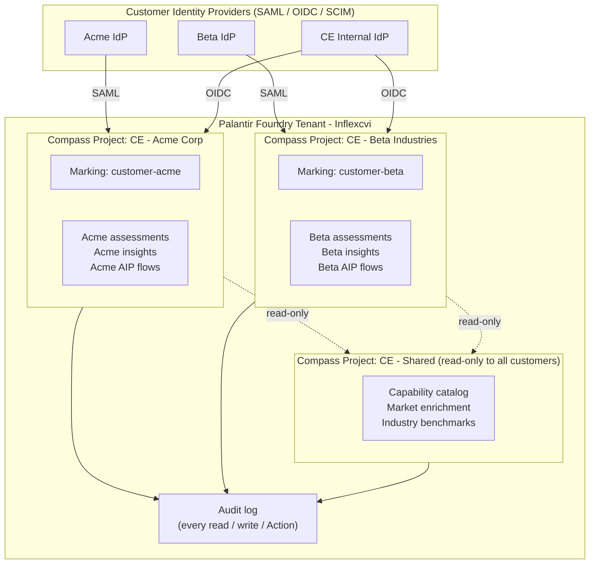

# SaaS Multi-Tenant Isolation Architecture

**Audience:** Investor / VC / PE diligence teams, prospective enterprise customers performing security review, internal engineering.

**Status:** Architectural plan. Implementation is gated on first paying customer signature (see *Rollout* section). Foundry primitives referenced below are platform features Inflexcvi (CE) inherits — not subsystems CE is building from scratch.

**Last reviewed:** 2026-04-25.

---

## 1. Goals

The Inflexcvi platform serves enterprise, F500, and regulated buyers (financial services, energy, healthcare-adjacent). These buyers will not sign without a defensible answer to "how do you isolate our data from every other customer's data?" This document describes the isolation model, the controls that enforce it, and the audit posture that demonstrates enforcement.

Concretely, the goals are:

1. **Strict per-customer data isolation.** A user belonging to Customer A must be unable, by any path (UI, API, agent, function call, dataset query), to read, infer, or aggregate Customer B's data.
2. **Defense in depth.** Isolation is enforced at multiple independent layers — Project, Marking, Object Type / row, Action, and audit. A single misconfiguration at one layer should not result in cross-tenant exposure.
3. **Auditable access.** Every read or write of customer data — including by CE internal staff — is logged with user identity, timestamp, and the resource touched. Audit logs are queryable for incident response and quarterly access reviews.
4. **Tenant lifecycle hygiene.** Onboarding a customer creates an isolated, properly tagged Project in 1–2 working days. Offboarding deletes or archives that Project as a single atomic operation.
5. **Honest scoping.** Be explicit about what Foundry covers (most of the heavy lifting) versus what CE must configure correctly (Markings, Project membership, Marking grants on Object Types and rows).

---

## 2. Architecture overview

Inflexcvi is built on Palantir Foundry. The isolation primitives we rely on are first-class platform features:

- **Compass Projects** — Foundry's top-level resource container. RBAC is applied at the Project level: a user with no role in a Project sees no resources inside it.
- **Markings** — Foundry's data-classification system. A Marking is a label on a resource (Dataset, Object Type, individual row) that gates access. Markings are *sticky*: data tagged with `customer-acme` carries that tag through transformations, AIP agent reads, and downstream Datasets. Access is denied at any boundary where the requesting user lacks the Marking grant.
- **Ontology Object Types** — typed object schemas. Object Types and individual rows can carry Markings.
- **AIP Logic agents** — agents are scoped to a Project and inherit the calling user's Marking grants. A shared agent cannot read Customer A data on behalf of Customer B.
- **Audit logs** — every Action invocation, Function call, Object Type read, and Dataset query is logged with the actor's identity.
- **Identity federation** — Foundry supports SAML 2.0, OIDC, and SCIM, so the customer's IdP (Okta, Azure AD, Ping, etc.) is the source of truth for identity.

The model is two-layered. First, Compass Projects partition resources so that membership is the gating control for *visibility*. Second, Markings provide a data-classification layer that survives even when data flows out of a Project (e.g., into a function output, an AIP agent context window, or a downstream Dataset). Even if a Project's RBAC were misconfigured, a Marking grant check would still deny the request.

---

## 3. Per-tenant resource layout

### 3.1 Compass Project per customer

Each paying customer gets a dedicated Compass Project named `CE - {Customer}` (e.g., `CE - Acme Corp`). The Project contains:

- The customer's Datasets (raw uploads, assessment data, derived insights).
- The customer's Object Type *instances* (see 3.3 for the shared-vs-per-tenant tradeoff).
- AIP Logic flows scoped to that Project.
- Notepad / Quiver / Workshop artifacts the customer interacts with.

The CE internal organization Project structure starts under the `CE Project` folder we provisioned at `ri.compass.main.folder.0b7baf38-d7f4-4413-aa27-962236f947d2`. New customer Projects sit as siblings under that folder.

Project-level RBAC ensures that a user without a Project role sees zero resources. This is the first and coarsest control.

### 3.2 Per-customer Marking

For every customer Project, we create a Marking with slug `customer-{slug}` (e.g., `customer-acme`). Every Dataset, Object Type, and where applicable every row carries this Marking. A user must hold the corresponding Marking grant to read tagged data.

Markings are the *load-bearing* control. If a user is mistakenly added to a Project but lacks the Marking grant, they still cannot read the data. Conversely, if data accidentally flows out of the Project into a shared Dataset, the Marking travels with it and downstream access is still gated.

### 3.3 Object Types: shared schema vs. per-tenant instance — tradeoff

We have a choice for tenant-specific data:

**Option A — per-customer Object Types.** Define `acme.Capability`, `beta.Capability`, etc. Pro: trivial isolation, no row-level marking required. Con: schema drift across customers, painful to evolve the data model, makes shared analytics nearly impossible.

**Option B — shared Object Types with row-level Markings.** Define `ce.Capability` once, and tag each row with the relevant `customer-{slug}` Marking. Pro: one schema to evolve, clean ontology, easier for our internal models. Con: row-level Marking discipline is the only thing preventing cross-tenant leakage.

**Decision.** We use **Option B for assessment data, insights, and customer-authored capability data** — a single `ce.*` ontology with row-level Markings. Foundry's Ontology Object Type properties support per-row Marking assignment, and queries are filtered against the caller's Marking grants. We use **Option A for any customer that explicitly contracts for schema customization** (rare, enterprise-only).

The tradeoff is acknowledged: row-level Markings put more weight on correct *write*-time tagging. We mitigate via a Foundry Function that all writes funnel through, which sets the Marking from the calling user's tenant context — there is no code path that writes a row without a Marking.

### 3.4 AIP Logic flows: per-tenant vs. shared — tradeoff

Same axis. We default to **shared AIP Logic flow definitions** with per-invocation tenant context. The flow is defined once; when invoked, it runs as the calling user, inherits their Marking grants, and reads only Marking-permitted rows. This is the same isolation logic Foundry applies to humans.

A small number of customers (regulated, FedRAMP-aligned) may want a flow physically copied into their Project for change-management reasons. We support that on request.

---

## 4. Identity and access

### 4.1 Federated identity

Customers connect their identity provider to Foundry via SAML 2.0, OIDC, or SCIM. We do not provision local user accounts for customer staff. A user joins or leaves the customer's IdP and that change propagates into Foundry via SCIM. This means employee offboarding at the customer is the source of truth — we cannot accidentally leave a stale account active.

### 4.2 Marking grants

When a user from Customer A's IdP is provisioned into Foundry, an automated SCIM hook (or, initially, a manual onboarding step) grants them:

- Project membership in `CE - Acme Corp` with the appropriate role (typically Editor for power users, Viewer for read-only).
- The `customer-acme` Marking grant.
- Read access to `CE - Shared`.

A user from Customer A's IdP **never** receives a `customer-beta` Marking grant. Even if they later authenticate to a wrong URL or attempt to query a shared Dataset, every Marking-gated read is denied.

### 4.3 CE internal staff

CE engineering and customer-success staff hold an `internal` Marking that grants cross-customer view for support purposes. This is necessary — we cannot debug a customer issue we cannot see. Compensating controls:

- Every internal access is audit-logged with the staff member's identity, the resource accessed, and timestamp.
- Audit logs are reviewed quarterly as part of an access review (described in 9.2).
- Internal staff cannot *write* into customer Projects without a paired customer approval step (Foundry Action with two-actor approval).
- The `internal` Marking is granted only to the small subset of CE staff who need it. Marketing, sales, finance staff do not receive it.

We are explicit with customers in the security questionnaire: "yes, CE engineering can read your data for support; every access is logged and reviewable; you can request the audit log for your Project at any time."

---

## 5. Data flow isolation

Three categories of data flow through the platform, with different isolation rules:

### 5.1 Customer-owned data — strict isolation

Assessment uploads, scorecard inputs, organization-specific capability assessments, and derived insights live exclusively in the customer's Project, tagged with their Marking. They never flow into the Shared Project or another customer's Project.

### 5.2 Shared market enrichment — read-only fan-out

The capability catalog, per-capability market enrichment (CVI snapshots, source triangulations, market caps), industry benchmarks, and value-chain data are *not* customer-specific — they describe the market, not any customer. These live in `CE - Shared`, are tagged with a `ce-shared-public` Marking that every customer holds, and are read-only to customers.

This is critical for honest diligence: when we say "your data is isolated," that is true of *your* data. The market enrichment that powers the platform is a shared resource, computed once and referenced by all customers. It does not contain any customer-specific signal.

### 5.3 Output insights — back into customer Project

Insights and recommendations generated for a customer (portfolio recommendations, capability gap reports, AIP-generated narratives) are written back into the customer's Project, tagged with their Marking, and visible only to them.

---

## 6. Encryption

Foundry encrypts data at rest using AES-256 and in transit using TLS 1.2+. Key management is handled by the Foundry control plane; CE does not manage encryption keys. Customers on the FedRAMP-Moderate Apollo deployment have additional FIPS 140-2 validated cryptography. This is a platform-inherited control — see Palantir's published security documentation for current cipher suites and key-rotation cadence.

---

## 7. Compliance posture

Inflexcvi inherits the following compliance certifications from the Foundry platform:

- **SOC 2 Type 2** — Foundry holds an annual SOC 2 Type 2 attestation covering Security, Availability, and Confidentiality. CE will obtain a SOC 2 of its own scoping the application layer; the underlying platform attestation is referenced.
- **GDPR** — Foundry supports data-subject-access requests, right-to-erasure workflows, and EU-region data residency (Foundry has EU-hosted instances). Customers requiring EU residency will be deployed onto an EU Foundry instance.
- **FedRAMP-Moderate** — available via Foundry's Apollo deployment for U.S. federal customers. CE itself is not FedRAMP-authorized; customers requiring FedRAMP must contract on the Apollo path.
- **HIPAA, ITAR, CJIS** — selectively available on specific Foundry deployments. Any HIPAA engagement requires a BAA executed with both Palantir and CE.

These are platform certifications. CE inherits them when deployed on the corresponding Foundry instance — we do not re-certify them. For each customer with a specific compliance requirement, we document which Foundry deployment they are on and which certifications apply.

---

## 8. Responsibility split — what CE owns vs. what Foundry covers

This is the section diligence teams care about most. Reinventing platform-grade isolation is one of the surest ways to fail an enterprise security review.

| Concern | Foundry owns | CE owns |
|---|---|---|
| Network-layer isolation, TLS termination | Yes | No |
| Encryption at rest, key management | Yes | No |
| Identity federation (SAML/OIDC/SCIM) | Yes | Configures the integration per customer |
| RBAC enforcement on Projects | Yes | Configures Project membership |
| Marking enforcement (read/write gates) | Yes | Defines Markings, applies them correctly to data |
| Audit logging | Yes (logs every access) | Reviews logs quarterly, responds to incidents |
| Row-level security | Yes (the mechanism) | Tags rows correctly at write time |
| AIP agent isolation | Yes (agents inherit caller grants) | Writes agents that don't accidentally bypass via Functions |
| SOC 2 / FedRAMP / GDPR platform controls | Yes | Application-layer SOC 2 |
| Backup, disaster recovery, availability | Yes | No |
| Vulnerability management of platform | Yes | Application-layer dependency hygiene |
| Customer data lifecycle (retention, deletion) | Mechanism | Policy + Project lifecycle hooks |
| Onboarding / offboarding workflows | No | Yes — runbook in section 10 |

The honest framing for diligence: **CE is responsible for configuring Foundry's isolation primitives correctly and for application-layer controls.** Foundry is responsible for the primitives themselves. We do not implement crypto, RBAC engines, audit logging, or identity protocol parsers. We configure them.

---

## 9. Failure modes and mitigations

### 9.1 Misconfigured Marking grant — wrong customer can see data

*Mitigation.* Foundry exposes Marking lineage and grant queries. We run a daily automated check that asserts the invariant: for every Object Type row tagged `customer-{X}`, no user outside Customer X's IdP holds the `customer-{X}` Marking grant (allowing only the `internal` exception list). Violations page on-call.

Additionally, the Marking *is* the gate. Project membership without the Marking grant yields no data — the row-level Marking enforcement catches the failure even if Project membership is wrong.

### 9.2 Internal staff abuse

*Mitigation.* Quarterly access review of the `internal` Marking grant list — we drop staff who no longer need it. Audit logs of internal-staff reads against customer Projects are reviewed quarterly by the CE security lead, with anomalies (volume spikes, off-hours access, access to a Project the staff member has no support ticket against) flagged for follow-up. Customers can request their Project's audit log on demand.

### 9.3 API exfiltration via leaked token

*Mitigation.* Foundry API tokens are scoped — a token issued to a customer user inherits that user's Marking grants and Project memberships. A leaked token cannot read more than the user behind it could read. Token-level controls available: short TTL, IP allowlist (Foundry feature), and per-token scope restrictions. We default customer-issued tokens to 24-hour TTL and require IP allowlisting for any token granted broader-than-read scope.

### 9.4 Cross-tenant query via a shared Function or AIP flow

*Mitigation.* Foundry Functions and AIP flows execute *as the calling user* by default. Marking enforcement applies to every Object Type read inside the function. A function that tries to read across tenants on behalf of a Customer A user would be denied — the user lacks the other customer's Marking grant. We do not write Functions that elevate privileges; the only privilege-elevation path is a Foundry Action with explicit approval, used for internal admin operations.

### 9.5 Data egress via export / download

*Mitigation.* Marking-tagged Datasets carry the Marking through export. Foundry's export controls allow disabling raw-Dataset download per Project; customers in regulated industries are configured with download disabled, and exports flow through an Action that strips PII and logs the egress.

### 9.6 Acknowledged residual risk

The honest list:

- Row-level Marking discipline relies on writes always going through the tenant-aware Function. A future code path that bypasses this Function and writes an unmarked row would create a hole. *Compensating control:* a daily job scans for unmarked rows in tenant-scoped Object Types and pages on-call.
- The `internal` Marking is a deliberate compromise for supportability. Customers who refuse internal access can be deployed on a fully isolated Foundry instance at additional cost; this is documented and offered.
- Foundry platform-level vulnerabilities are out of CE's control. We rely on Palantir's vulnerability management and SOC 2 attestations.

---

## 10. Rollout plan when first paying customer signs

This is the runbook executed when the first paying customer signs. Target: 1–2 working days from contract signature to customer login. Tracked as task #14; only triggers on signature.

**Day 1 — provisioning.**

1. Create Compass Project `CE - {Customer}` as a sibling of the CE Project folder (`ri.compass.main.folder.0b7baf38-d7f4-4413-aa27-962236f947d2`).
2. Create Marking `customer-{slug}`. Document the slug in the customer record.
3. Configure Foundry IdP integration with the customer's SAML/OIDC endpoint. Coordinate with the customer's IT. Test SCIM provisioning with a test user.
4. Grant the test user Project membership and the `customer-{slug}` Marking.
5. Apply `customer-{slug}` Marking to the Object Types and Datasets that will hold the customer's data. For shared `ce.*` types, configure the row-level Marking default for that customer's writes.
6. Grant the customer's Project read access to `CE - Shared`.

**Day 2 — verification and handoff.**

7. Provision the customer's first real user from their IdP. Confirm SCIM creates the Foundry user and applies the Marking grant.
8. Run the access verification suite:
   - Customer user sees their Project — pass.
   - Customer user sees `CE - Shared` read-only — pass.
   - Customer user attempts to read a different customer's Project (synthetic test tenant) — denied.
   - Customer user attempts a cross-tenant Object Type query — returns only their rows.
   - AIP agent invoked by customer user reads only their data — confirmed via audit log.
9. Enable download/export controls per the customer's contract terms.
10. Hand off the audit-log access procedure and the customer's security contact at CE.
11. Customer signs off on the access verification.

**Quarterly thereafter.**

- Access review of the `internal` Marking grant list.
- Review of audit logs for internal-staff access to that customer's Project.
- Confirm SCIM is still synchronized (stale user check).

---

## 11. References

- Palantir Foundry — *Compass Projects, Markings, Ontology* (Foundry product documentation).
- Palantir Foundry — *AIP Logic and agent permissions* (Foundry AIP documentation).
- Palantir Foundry — *Audit logging and access review* (Foundry administration documentation).
- Palantir — *Trust Center / SOC 2, FedRAMP, GDPR posture* (Palantir security documentation).
- CE internal — `docs/foundry-ontology-spec.md` for the Object Type definitions referenced above.
- CE internal — `docs/architecture-spec.md` for the broader platform architecture this isolation model sits inside.

URLs intentionally omitted; cite the canonical Palantir documentation pages current at the time of diligence.
